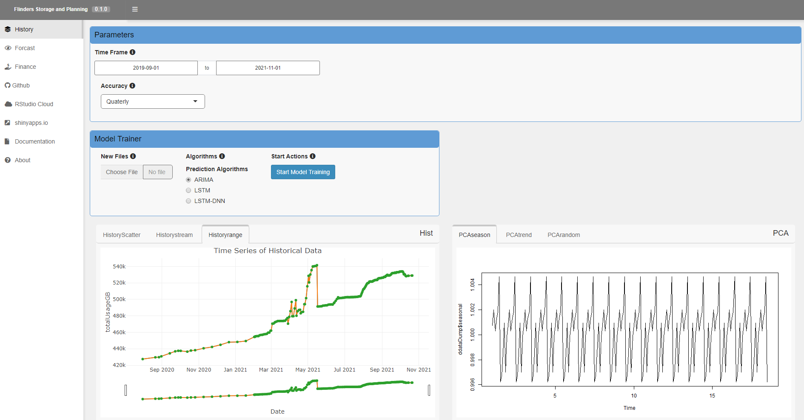
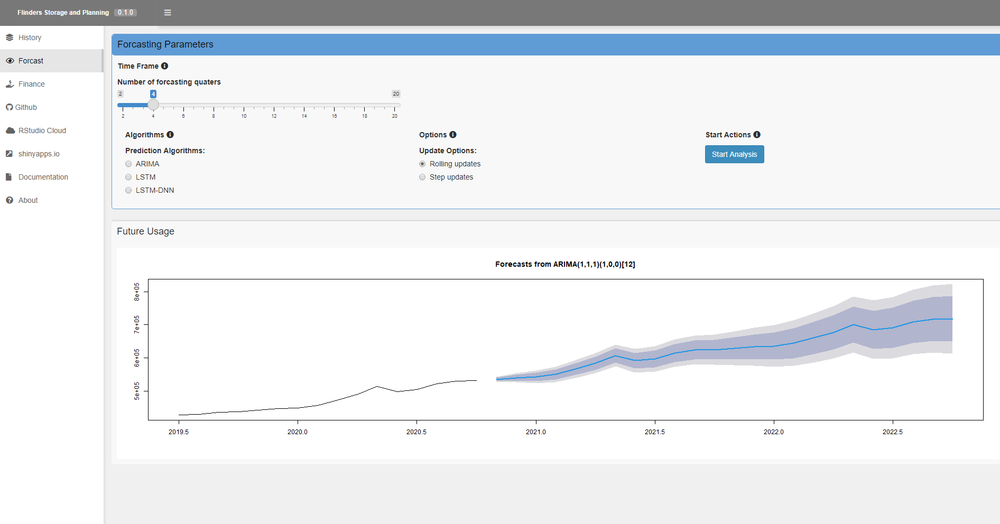
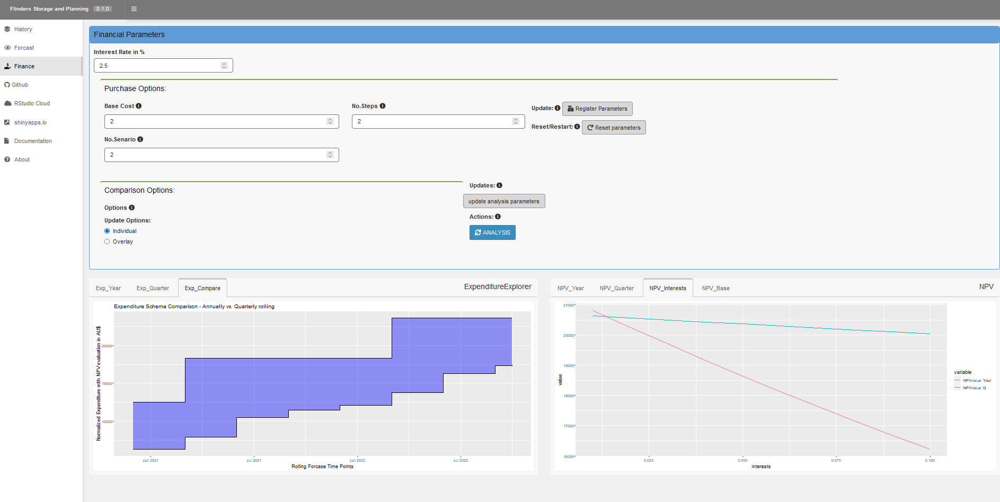
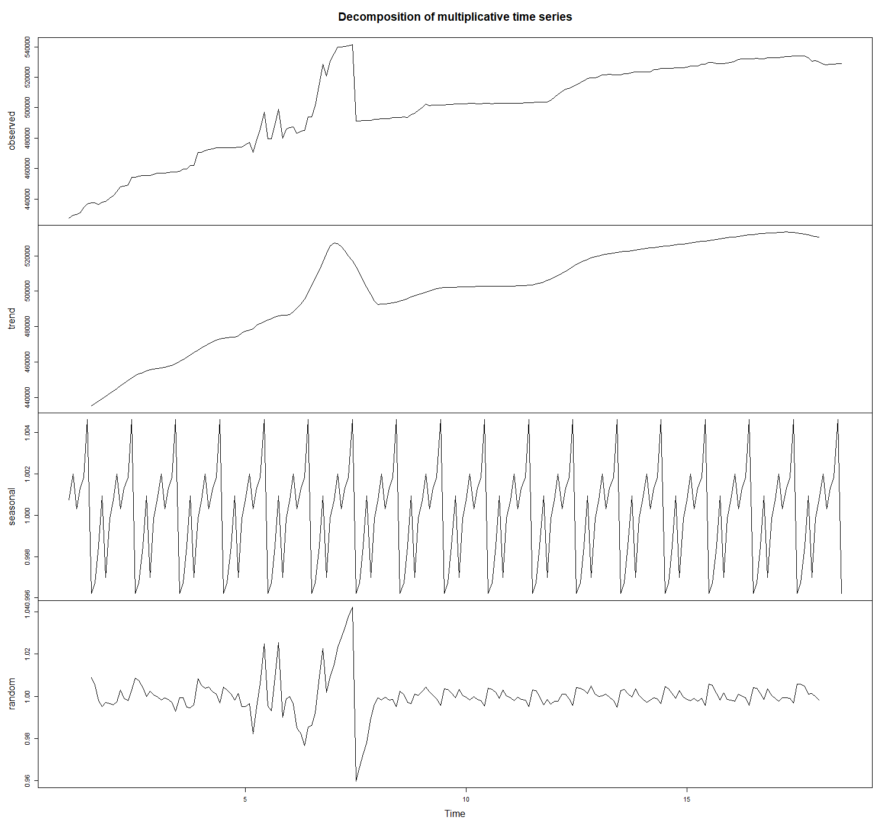
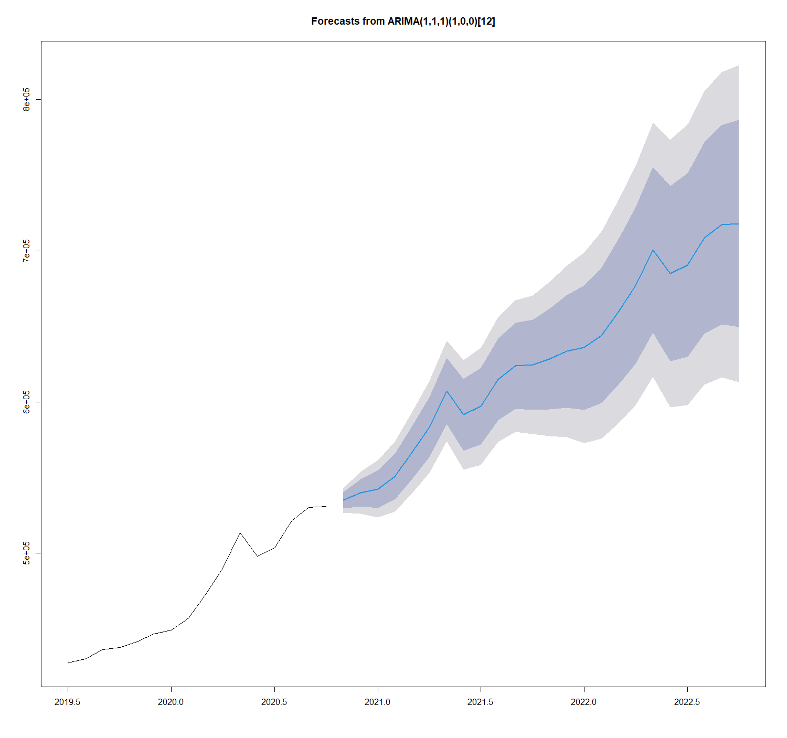
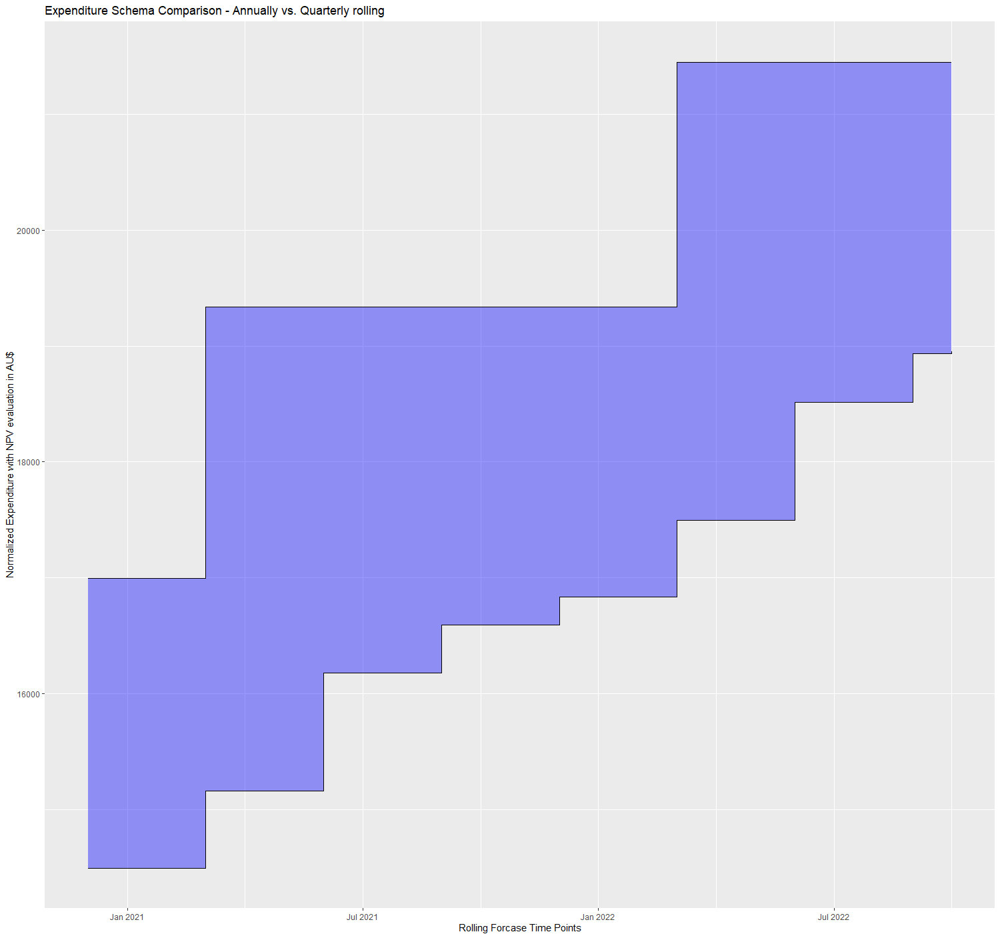
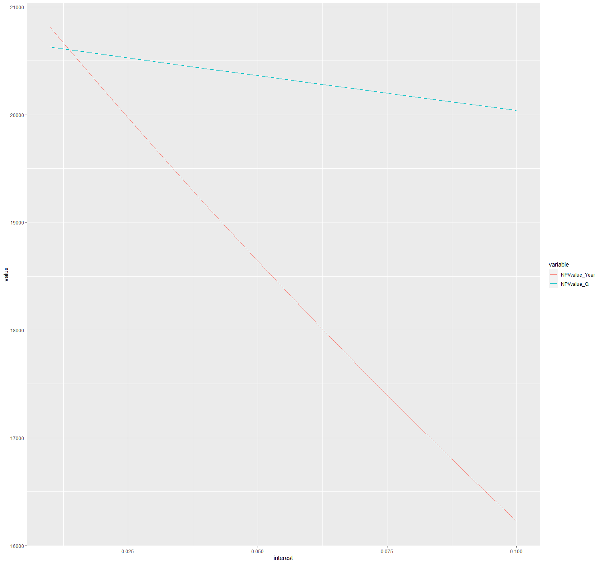

# Summary
`UtilityViz` is a R Shiny application that defined a pipeline that not only enable the estimation of future utility demand at a given environment but also provdied a suite of tools to facilitate historical data visualization and procument strategy simulation. In addition, the workflow has been optimized and streamlined with a comprehensive dashboard facility to encourage a swift user experience.

# Forcasting based on Time Series data
With the `UtilityViz` package, we provided three options to model future demand based on time series historical data. The three models readily available are AutoRegressive Integrated Moving Average (ARIMA), Long short-term memory (LTSM) and Long Short Term Memory-Deep Neural Network (LTSM-DNN). We recommend that ARIMA algorithm is used for the short period forecast (i.e, 1-2 years into the future) due to the combined factors of relatively accurate predictions and efficient model training; whilst modern deep learning algorithms including LSTM and LTSM-DNN are more computational expensive models to train, both models can be beneficial when historical/training data is abundantly available and accuracy requirement is high [@Akbar:2018].

# Dashboard Integration

The `UtilityViz` package streamlined the forecasting and financial analytics workflows with visual dashboards. The historical data board (Figure \ref{fig:dash-hist}) provides a visual inspection of the historical data and dissemination with principal component and tread analysis. The forecasting board (Figure \ref{fig:dash-pred}) aggregates various forecast options to present click and display style analytics. Last but not the least, the finance board (Figure \ref{fig:dash-fin}) provides integrated scenario simulations based on various procurement strategies before the cost-benefit envelope will be presented to facilitate the business decision-making.

 <!--- { width=80% } -->

 <!--- { width=99% } --->

 <!--- { width=80% } -->

# Case Study
The storage stake is one significant piece of infrastructure in modern business operations. The cost associated with managing exploding data volume can not be underestimated in modern increasing data-driven decision models. In the case study, we demonstrated that how different procurement strategies in responding to future digital storage capacity demand can deliver very different financial outcomes. 

The historical data for the past 18 months demonstrated a steady upward trend in storage capacity with a few large but sharp bumps along the way, which coincided with the management strategic shifting experienced at the institution. Despite a few bumps, the historical data demonstrated a strong seasonality (Figure \ref{fig:ana-decom}), therefore a simpler ARIMA forecast algorithm was suited for this study and hence selected. 

 <!--- { width=80% } -->

The rolling forecast of future storage demand at the institution based on ARIMA algorithms demonstrated a good fit with the historical data (Figure \ref{fig:ana-fore}). Given the strong seasonality demonstrated (Figure \ref{ana-decom}),  the quarterly rolling procurement strategy was worth further evaluation to draw a comparison with the traditional year-end bulk practice. Such analysis denoted in the net present value (NPV) consequently indicated a favourable outcome with the quarterly rolling strategy with the current low cash interest environment and base cost structure (Figure \ref{ana-perc}). Further simulation indicated that the operational envelope with the current base cost structure is in favour of a rolling procurement strategy at the institution as long as the cash interest is above 1% and the financial benefit continue to improve with the inflating cash rate (Figure \ref{fig:ana-com}). 

<!--- { width=80% } -->

 <!--- { width=80% } -->

 <!--- { width=80% } -->

# Acknowledgements
We would like to acknowledge that the production data used in the model training was made available by Information & Digital Services department at Flinders University, Australia, without this kindly support, this study would not be possible. 

# References